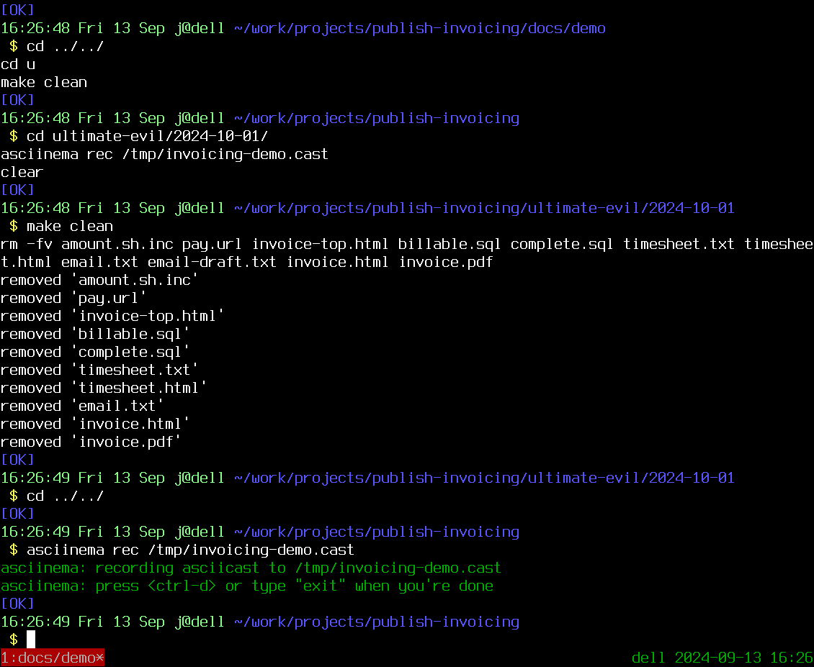
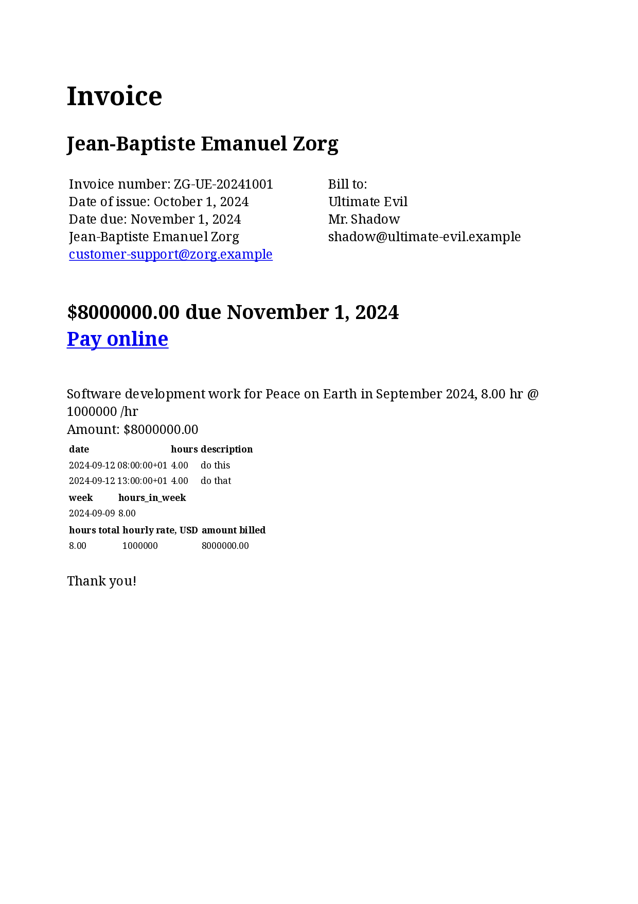

make sure taskdb is actual and everything relevant is tagged

cp customer-name/prev-month-date customer-name/new-month-date
cd customer-name/new-month-date
make clean
make timesheet.txt
cat timesheet.txt

create payment link with data from timesheet.txt
edit pay.url
edit env.sh.inc
edit email-template/*

make email-draft.txt
review it

edit invoice-top.html
make invoice.pdf
review it

make email.txt
